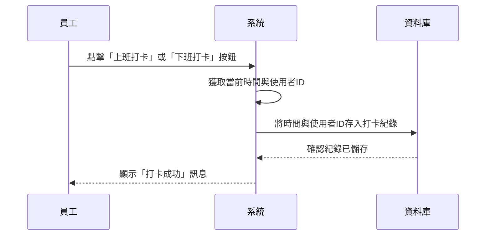
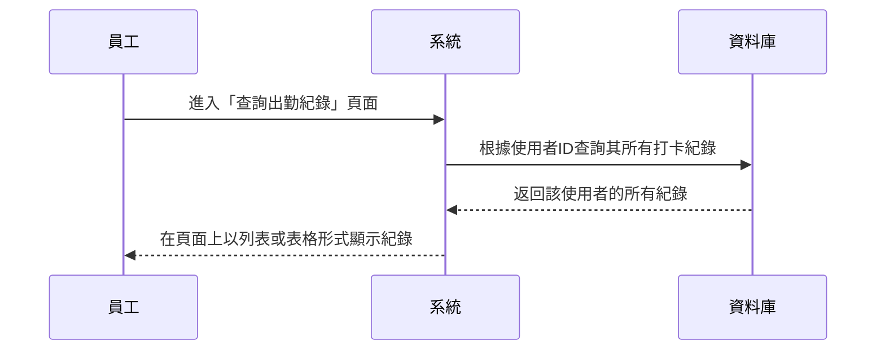

## 為什麼要做這個專題?

為了將公司員工的出勤記錄數位化，取代傳統的紙本或手動記錄方式。這將提高出勤記錄的效率、準確性，並方便後續的查詢與管理。

## 使用者是誰?

本專案主要有兩類使用者：

1.  **員工 (Employee)**: 公司的一般職員。
2.  **主管 (Manager)**: 負責管理團隊或部門的領導者。

## 他們希望能做什麼?

### 員工
- **打卡/簽到 (Clock-in/Clock-out)**: 能夠記錄上班與下班的時間。
- **查詢個人出勤紀錄**: 能夠查看自己的打卡歷史紀錄。

### 主管
- **查看團隊出勤狀況**: 能夠即時查看自己部門或團隊成員的當日出勤狀態。
- **查詢團隊出勤歷史**: 能夠查詢特定時間範圍內，團隊成員的出勤紀錄。
- **匯出報表**: 能夠將團隊的出勤紀錄匯出成簡單的報表（例如 CSV 或 Excel）。

## 成功的指標是什麼?

- **高使用率**: 系統上線後，所有員工都能順利地每天使用它來記錄出勤。
- **減少管理時間**: 主管花在確認與統計出勤的時間顯著減少。
- **資料準確性**: 系統能夠提供準確、即時的出勤數據。
- **使用者滿意度**: 員工與主管對於此系統的操作簡易性與功能感到滿意。

## 哪些不在專案範圍內?

為了保持專案的簡易性，以下功能將**不**包含在此次開發範圍內：

- **薪資系統整合**: 不會自動計算薪水。
- **複雜的假單管理**: 不包含請假、休假、公出的申請與審批流程。
- **進階分析報表**: 不提供複雜的數據分析與視覺化圖表。
- **行動應用程式 (Mobile App)**: 初期以網頁版為主，不開發原生的手機 App。
- **GPS 地點限制**: 打卡功能不與地理位置掛鉤。
- **加班與補休管理**: 不處理加班費計算或補休申請/記錄。
- **排班與輪班功能**: 不提供讓主管安排員工班表的功能。
- **與人資(HR)系統整合**: 不會與既有的人資系統（如員工資料、薪資條）進行資料同步。
- **即時通知功能**: 例如員工遲到、缺勤時，系統不會自動發送 Email 或訊息通知主管。
- **多地點/多時區支援**: 系統預設所有使用者都在單一時區與單一辦公地點。
- **生物辨識整合**: 不支援指紋、人臉辨識等硬體打卡設備。
- **詳細的稽核軌跡 (Audit Trail)**: 不會記錄每一次出勤資料修改的詳細歷史（誰、在什麼時間、改了什麼）。

## 流程圖

### 打卡/簽到 (Clock-in/Clock-out)

### 查詢個人出勤紀錄

