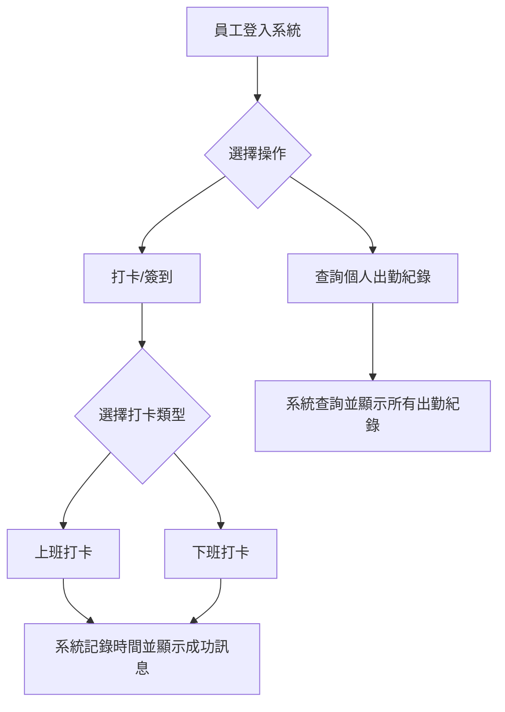
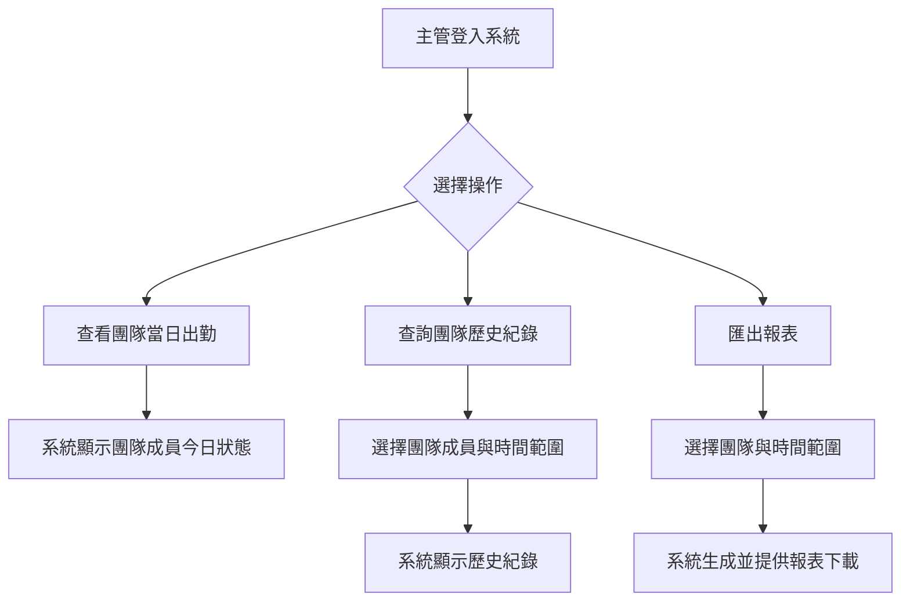
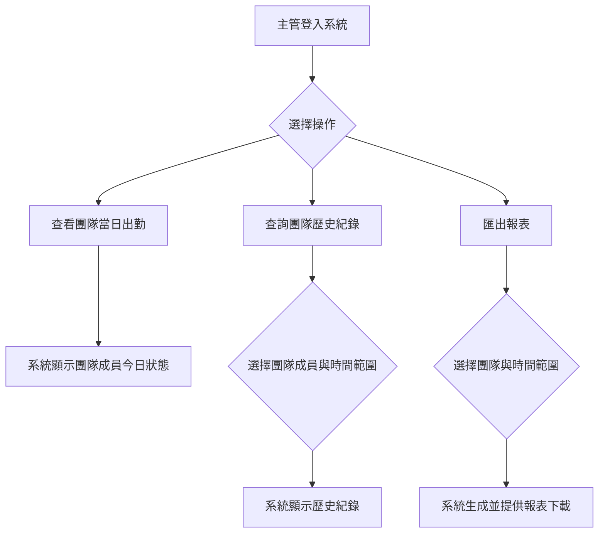
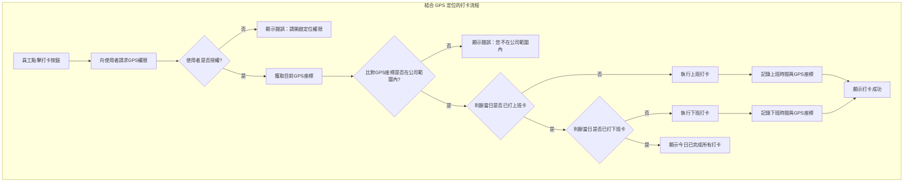
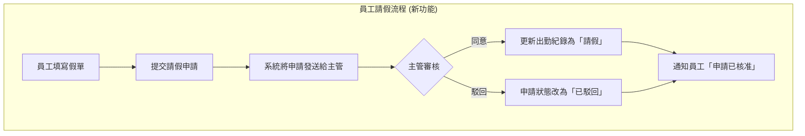
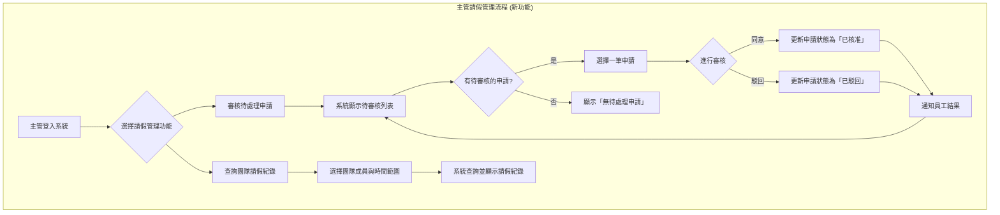

# 員工操作流程圖



# 主管操作流程圖




# 員工操作流程圖


# 主管操作流程圖




# 主管審核出勤流程 (新功能)

```mermaid
flowchart TD
    subgraph "主管審核出勤流程 (新功能)"
        A[主管進入審核頁面] --> B[系統顯示待審核的異常紀錄<br>(例如：忘打卡、手動補登申請)]
        B --> C{有待審核的紀錄?}
        C -- 是 --> D[選擇一筆紀錄]
        C -- 否 --> E[顯示「無待審核項目」]
        D --> F{進行審核}
        F -- 同意 --> G[更新紀錄狀態為「已核准」]
        F -- 駁回 --> H[紀錄狀態改為「已駁回」並通知員工]
        G --> B
        H --> B
    end
```

# 員工操作流程圖


# 主管操作流程圖


# 結合 GPS 定位的打卡流程



# 員工請假流程 (新功能)



# 主管請假管理流程 (新功能)



