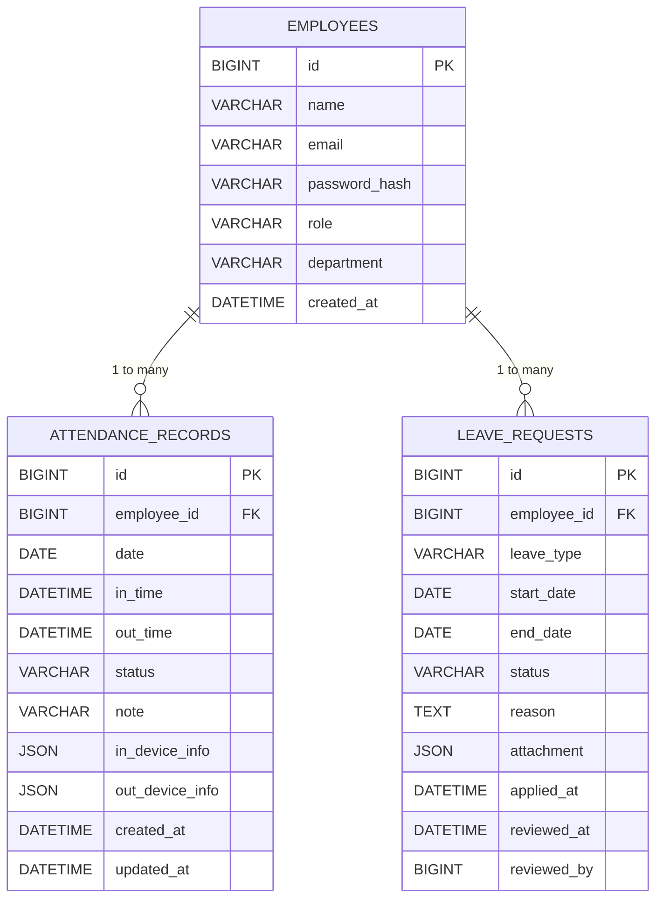
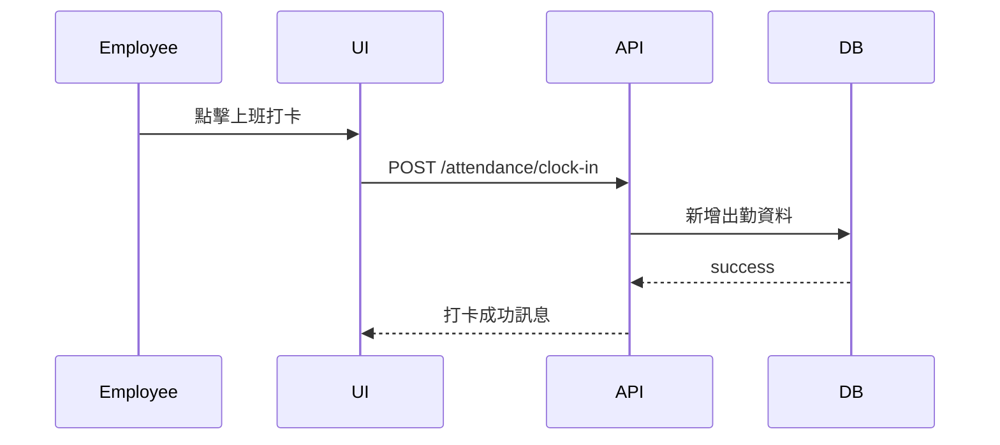
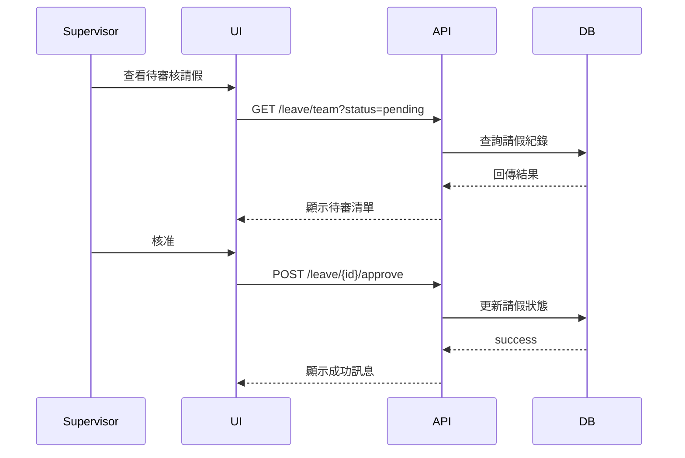

## 1. 系統目標

本系統提供員工及主管完整的出勤管理流程，解決員工打卡、主管管理與審核的需求。

主要功能包含：

| 角色 | 功能                            |
| -- | ----------------------------- |
| 員工 | 上/下班打卡、查看自身出勤紀錄、請假申請          |
| 主管 | 查看團隊出勤狀況、審核請假、匯出報表、手動補登出勤（選配） |

系統採 Web / Mobile 前端 + RESTful API 後端架構，提供即時回饋及資料紀錄。

---

## 2. 系統架構（Architecture）

[ Web ]
│   HTTPS
▼
[ Backend RESTful API ]  (Spring Boot / Node ... )
│
▼
[ MySQL Database ]

前端負責頁面呈現與 API 呼叫
後端負責業務邏輯：打卡 / 審核 / 權限 / 匯出報表
DB 儲存出勤與請假資料

---

## 3. 系統模組設計（Module Design）

| 模組                      | 描述                           |
| ----------------------- | ---------------------------- |
| Authentication Module   | 帳號驗證與角色權限                    |
| Attendance Module       | 打卡及異常處理                      |
| Leave Module            | 請假申請、審核流程                    |
| Reporting Module        | 出勤與請假報表產生                    |
| Notification Module（選配） | 審核狀態通知（Email / LINE / Slack） |

---

## 4. 資料庫設計（ER Diagram）

---

## 5. 資料表設計（MySQL）

### 5.1 employees

| 欄位            | 型態           | 描述                            |
| ------------- | ------------ | ----------------------------- |
| id            | BIGINT       | 員工編號                          |
| name          | VARCHAR(200) | 員工姓名                          |
| email         | VARCHAR(200) | 登入帳號 / Email                  |
| password_hash | VARCHAR(200) | 密碼加密儲存                        |
| role          | VARCHAR(20)  | employee / supervisor / admin |
| department    | VARCHAR(100) | 單位名稱                          |

---

### 5.2 attendance_records

| 欄位                 | 型態           | 描述                        |
| ------------------ | ------------ | ------------------------- |
| employee_id        | FK           | 哪一位員工                     |
| date               | DATE         | 出勤日期                      |
| in_time / out_time | DATETIME     | 上班 / 下班時間                 |
| status             | VARCHAR(20)  | normal / pending / manual |
| note               | VARCHAR(500) | 補登理由（若有）                  |
| device_info        | JSON         | 紀錄裝置及操作資訊                 |

---

### 5.3 leave_requests

| 欄位                    | 型態          | 描述                            |
| --------------------- | ----------- | ----------------------------- |
| employee_id           | FK          | 申請人                           |
| leave_type            | VARCHAR(50) | 請假類型（事假、病假、年假等）               |
| start_date / end_date | DATE        | 請假期間                          |
| status                | VARCHAR(20) | pending / approved / rejected |
| reviewed_by           | BIGINT      | 審核主管                          |

---

## 6. API 設計（RESTful）

### 🔐 Auth API

| Method | Endpoint       | Description  |
| ------ | -------------- | ------------ |
| POST   | /auth/login  | 回傳 JWT Token |
| POST   | /auth/logout | 登出（清除 Token） |

---

### 🟢 Attendance API（出勤管理）

| Method | Endpoint                   | Description |
| ------ | -------------------------- | ----------- |
| POST   | /attendance/clock-in     | 上班打卡        |
| POST   | /attendance/clock-out    | 下班打卡        |
| GET    | /attendance/me?start&end | 查詢個人出勤      |

---

### 🟡 Leave API（請假管理）

| Method | Endpoint              | Description |
| ------ | --------------------- | ----------- |
| POST   | /leave/apply        | 員工提交請假申請    |
| GET    | /leave/me           | 查詢個人請假紀錄    |
| GET    | /leave/team         | 主管：查看團隊請假   |
| POST   | /leave/{id}/approve | 核准請假        |
| POST   | /leave/{id}/reject  | 駁回請假        |

---

### 📊 Report API（報表）

| Method | Endpoint                      | Description           |
| ------ | ----------------------------- | --------------------- |
| GET    | /reports/download?start&end | 匯出團隊出勤紀錄（CSV / Excel） |

---

## 7. 序列圖（Sequence Diagram）

### 7.1 員工打卡流程

---

### 7.2 請假審核流程

---

## 8. 權限控管（RBAC）

| Role       | 可執行動作            |
| ---------- | ---------------- |
| employee   | 打卡、查詢自身出勤、請假申請   |
| supervisor | 查看團隊出勤、審核請假、報表匯出 |
| admin      | 系統設定、員工管理        |

---

## 9. 非功能性需求（NFR）

| 項目    | 說明                       |
| ----- | ------------------------ |
| 安全性   | JWT + HTTPS，密碼加密（bcrypt） |
| 可用性   | 系統應保持 99.9% uptime       |
| 擴展性   | 報表產出使用非同步 task，避免 API 卡死 |
| 資料完整性 | 所有修改應紀錄審核流程（誰、何時、做了什麼）   |
| 隱私    | 僅記錄必要資料，資料存取依權限控管        |

---

## 10. 錯誤處理（Error Handling）

| 錯誤情況       | 系統回應                        |
| ---------- | --------------------------- |
| 已打過上班卡     | 回應 409 already_clocked_in |
| 下班打卡但無上班紀錄 | 回應 400 invalid_clock_out  |
| 請假日期重疊     | 回應 409 conflict           |
| 無權限        | 回應 403 forbidden          |

---